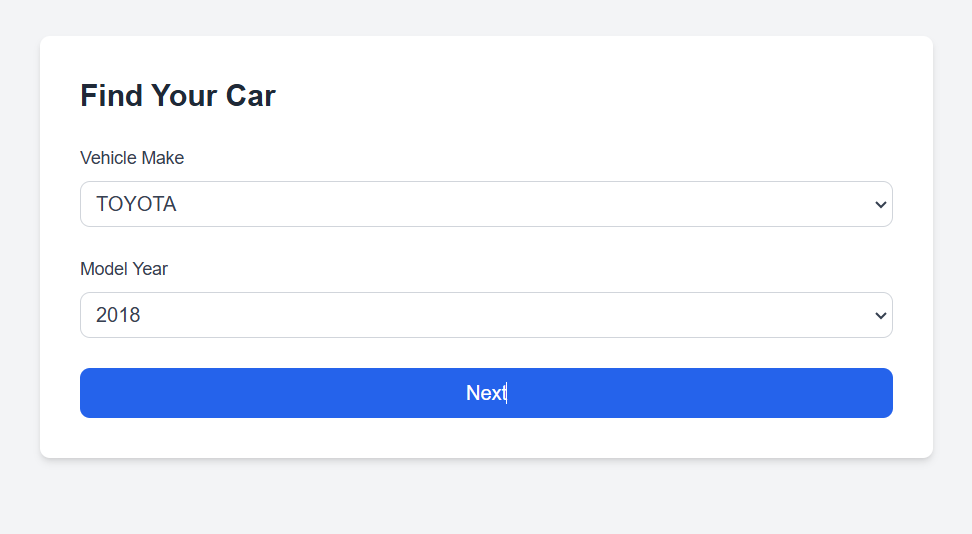
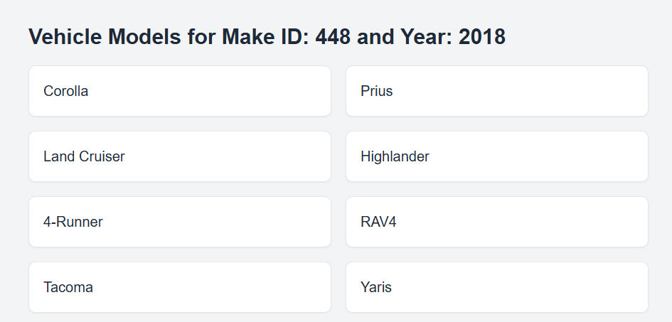

# Car Dealer Application

This is a car dealer application built using **Next.js**, **React Hook Form**, **Yup**, **TypeScript**, and **Tailwind CSS**. The application allows users to filter vehicles by make and model year and view the results on a separate page.



## Features

- **Filter vehicles** by make and model year.
- **Display a list of vehicles** based on selected filters.
- Use of **React's Suspense** for handling loading states.
- **Responsive design** using Tailwind CSS.
- **Form handling** with **React Hook Form** and **Yup** for validation.

## Setup Instructions

### 1. Clone the repository
Clone the project from GitHub to your local machine:

```
git clone https://github.com/yuliahalaniuk/car-dealer-app.git
```

### 2. Install dependencies

Navigate to the project directory and install the necessary dependencies:

```
cd car-dealer-app
npm install
```

### 3. Add Environment Variables
Create a .env.local file in the root directory and add the following environment variables:

```
NEXT_PUBLIC_API_URL=
```

### 4. Run the development server
Start the development server using the following command:

```
npm run dev
```
This will start the application at http://localhost:3000.

### 5. Build the application for production
To build the production version of the app, run:

```
npm run build
```
This will generate a production-ready build of the app.

### 6. Access the Result Page
Once the filters are applied, the user can navigate to the result page, which dynamically displays vehicle data based on the selected make and year.

## Technologies Used
 - Next.js
 - Tailwind CSS
 - React Hook Form
 - Yup
 - TypeScript
 - ESLint & Prettier

 ## Folder Structure
The project is organized as follows:

>  **/app**
  >> **/(home)**    // Home page with filter form
  >
  >> **/result/[makeId]/[year]**   // Result page showing vehicle models
  >
  >> **/loading.tsx** 
  >
  >> **/layout.tsx** 
  
>  **/components** 
>
>  **/utils**
>
>  **/types**
  